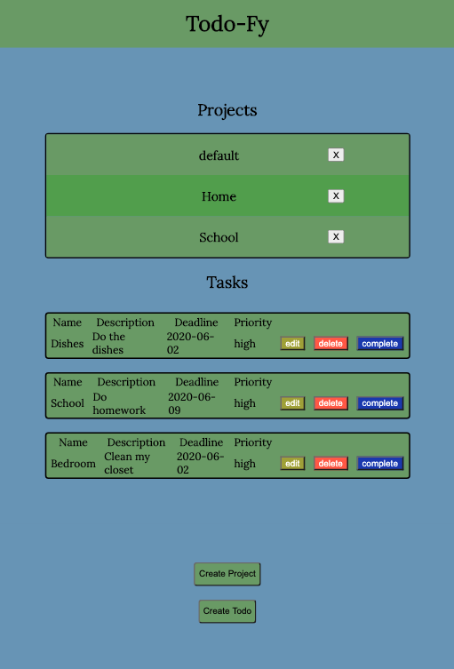

# Todo List App.

> This project consist on a simple web app where a user can introduce projects and todos for each project. This webpage make use of the local storage so tasks and projects are kept even if the browser is closed.

## Desktop

## Mobile

## Built With
- JS ES6
- Webpack
- Module Pattern
- CSS

## Live Demo
[Live Demo Link :rocket:](https://rawcdn.githack.com/davitomix/TodoAppJS/00187fce98dd54500348ec6616344ea44821b015/dist/index.html)

## Getting Started
- Download the repo in your computer.
- Drag and drop the index.html file from the dist folder into your web browser.
- Enjoy.

## Authors
👤 **David Elí**

- Github: [@davitomix](https://github.com/davitomix)
- Twitter: [@davitomix007](https://twitter.com/davitomix007)
- Linkedin: [David Garcia](https://www.linkedin.com/in/davideligarcia/)

👤 **Feber Alejandro**

- Github: [@cochabambinoski](https://github.com/cochabambinoski)
- Twitter: [@cochabambinoski](#)
- Linkedin: [Feber](#)

## 🤝 Contributing
Contributions, issues and feature requests are welcome!

Feel free to check the [issues page](issues/).

## Show your support
Give a ⭐️ if you like this project!

## 📝 License
This project is [MIT](lic.url) licensed.
